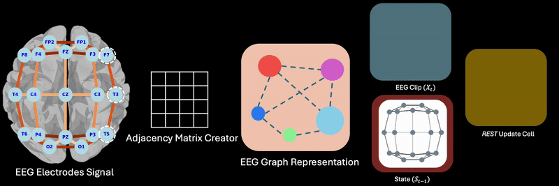

# REST: Efficient and Accelerated EEG Seizure Analysis through Residual State Updates





# Abstract

EEG-based seizure detection models face challenges in terms of inference speed and memory efficiency, limiting their real-time implementation in clinical devices.

This paper introduces a novel graph-based residual state update mechanism (REST) for real-time EEG signal analysis in applications such as epileptic seizure detection. By leveraging a combination of graph neural networks and recurrent structures, REST efficiently captures both non-Euclidean geometry and temporal dependencies within EEG data.

Our model demonstrates high accuracy in both seizure detection and classification tasks. Notably, REST achieves a remarkable 9-fold acceleration in inference speed compared to state-of-the-art models, while simultaneously demanding substantially less memory than the smallest model employed for this task. These attributes position REST as a promising candidate for real-time implementation in clinical devices, such as Responsive Neurostimulation or seizure alert systems.


# Code

The model is located at `REST.py` and by using the `Train_Rest.py` you can easily train REST.

Simple update of REST can be applied by:

```
def update(self, x_t , edge_index , edge_weight  , s_t , fire_rate ):

        if s_t is  None:
            s_t =   self.l1(x_t)      
        else:
            s_t =   self.l1(x_t) +  self.l2(s_t)


        
        ds = self.gc1(s_t , edge_index ,  edge_weight.float() )
        ds = ds.relu()
        ds = self.gc2(ds , edge_index ,  edge_weight.float() )

        update_mask = torch.rand(ds.size()).float().cuda() <= fire_rate
        ds *= update_mask
        s_t = s_t + ds
        
        return s_t 

```

### 🧠 Super Cool Idea: Neural Cellular Automata (NCA)

This project is inspired by the **super cool concept of Neural Cellular Automata (NCA)** — models that self-organize complex behavior through simple, local rules, much like how biological cells operate.

> 🧬 NCA models update each “cell” in parallel using local context, enabling **emergent computation** over time — perfect inspiration for spiking and message-passing systems on graphs!

🔗 **Read the original paper**: [*Growing Neural Cellular Automata* by Mordvintsev et al. (2020)](https://distill.pub/2020/growing-ca/)
